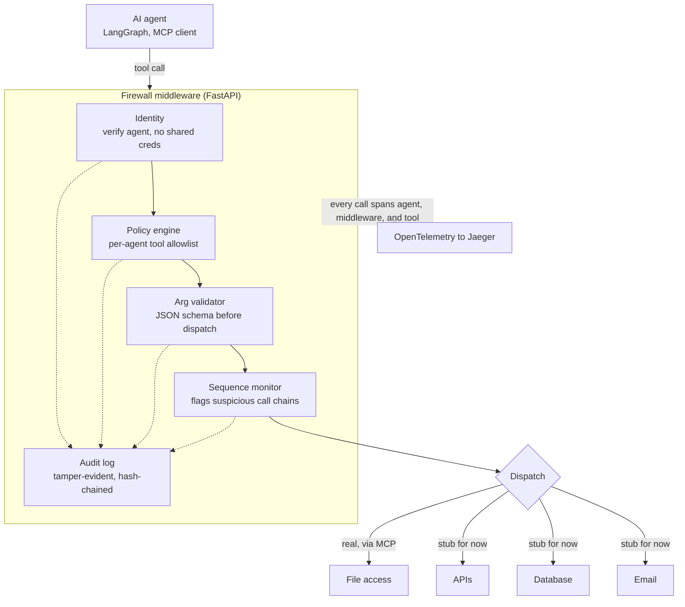

# Agent Runtime Firewall

AI agents are being handed real tool access — filesystems, email, databases, internal APIs — faster than anyone is verifying who's actually calling those tools or what they're allowed to do. 40+ MCP/agent-related CVEs surfaced in just the first four months of 2026, and even the platforms enterprises are building agent infrastructure on (Microsoft, IBM, Boomi) acknowledge that real-time identity verification and enforcement for agent tool calls is still an open problem, not a solved one.

This project is that missing layer: a reverse proxy that sits between an agent and the tools it's given access to, so enforcement is structural rather than optional. An agent has no direct path to a real tool — only a path through the firewall — so a compromised, careless, or simply buggy agent can't skip identity verification, policy checks, or the audit trail, because there's nothing to skip *to*.

**Status: the full 10-day build plan is complete.** See [build-plan.md](build-plan.md) for the day-by-day log of what was built and why. Identity, policy enforcement, a tamper-evident audit log, a sequence monitor, OpenTelemetry tracing, real MCP dispatch, and a real Groq-driven LangGraph agent are all implemented and verified — not just described.

## Architecture



Key design decision: the firewall is a **reverse proxy for MCP, not a library** an agent has to import correctly. A library can be skipped by a careless or compromised agent; a proxy that owns the only path to real tools makes enforcement structural instead of cooperative.

## Try it yourself in 2 minutes

No API keys, no cost — this uses stub-backed and real-MCP-backed tools only, never the LLM-driven agent.

```
docker compose up -d --build
python scripts/try_it_yourself.py
```

This registers agents and fires three canned requests, live, against the real system:
1. **Allowed** — reads a real file through a real MCP filesystem server.
2. **Denied by policy** — tries a tool that isn't on the agent's allowlist.
3. **Denied by sequence monitor** — a read-then-send pattern that's blocked even though both individual tools are allowed.

Then open `http://localhost:16686` (Jaeger), pick service `agent-runtime-firewall`, and click "Find Traces" to see the actual waterfall for each decision — which stage ran, how long it took, and whether dispatch hit a real backend or a stub.

## What's here right now

- `app/identity.py` — each agent gets its own Ed25519 keypair at registration. No shared secrets. Agents sign a short-lived (60s) JWT per request with their private key; the server verifies it against the stored public key.
- `app/policy.py` — per-agent policy engine: checks a tool call against the agent's allowlist, then validates its arguments against a JSON schema (`policies.json`).
- `app/sequence.py` — sequence monitor: keeps a short rolling history of each agent's recent tool calls in memory and blocks a call if it completes a `{trigger, follow, window}` pattern from `sequence_rules.json` (v1 ships one rule: `read_sensitive_file` → `send_email` within 3 calls).
- `app/audit.py` — every allow/deny decision (from policy or sequence checks) is appended to a single hash chain (`audit_log` table): each entry hashes its own fields plus the previous entry's hash, so editing or deleting any row breaks every hash after it. Sequence violations are logged at `severity: "high"`. `verify_chain()` recomputes the chain and reports the first broken entry, if any.
- `app/tracing.py` — sets up OpenTelemetry once at startup, exporting spans to the console and to a local Jaeger instance via OTLP/HTTP.
- `app/mcp_client.py` — a persistent client for a **real** MCP server: launches the official `@modelcontextprotocol/server-filesystem` (via `npx`) as a subprocess over stdio, sandboxed to `mcp_sandbox/`, and exposes `call_tool()` for the firewall to use.
- `app/main.py` — `/agents/register` to issue an identity, `/whoami` as a protected endpoint, `/proxy/{tool_name}` as the gated tool-call endpoint (identity → policy → arg validation → sequence check → audit log → dispatch), with each stage wrapped in its own OpenTelemetry span nested under one parent span per call. Dispatch is real for MCP-backed tools (`list_directory`, `read_file`) when the MCP server is up, and falls back to a stub for every other tool. Uses FastAPI's `lifespan` to keep one MCP session open for the server's whole lifetime.
- `agent/langgraph_agent.py` — a real LangGraph agent (`create_react_agent`, Groq-backed) that never talks to MCP directly — every tool call it makes goes over HTTP to `/proxy/{tool_name}`, signed exactly like every other agent in this project. This is what proves enforcement is structural, not something an agent has to cooperate with.
- `Dockerfile` / `docker-compose.yml` — containerizes the firewall (with Node.js so real MCP dispatch works inside the container too) alongside Jaeger, so the whole system comes up with one command.
- `scripts/try_it_yourself.py` — the 2-minute canned demo described above.
- `scripts/demo_client.py` — registers an agent, proves a valid signed request is accepted, and proves a missing or forged token is rejected.
- `scripts/demo_policy.py` — registers two agents with different policies, proves an allowed call succeeds, a call with bad arguments is blocked, a call to a tool outside the agent's allowlist is blocked, and that all 4 decisions land in an intact audit chain.
- `scripts/demo_sequence.py` — proves `send_email` alone is fine, but `read_sensitive_file` followed by `send_email` within the window is blocked even though both tools are individually allowed — and that the denial is logged at high severity.
- `scripts/demo_mcp_dispatch.py` — proves `/proxy` dispatches to the **real** MCP filesystem server (not a stub): real directory listing, real file contents, a path outside the sandbox blocked by our own policy schema before MCP is even called, and a `write_file` attempt blocked because it's not on the agent's allowlist at all.
- `scripts/verify_audit.py` — walks the audit log's hash chain standalone (no server needed). `--tamper` corrupts a scratch copy of the DB first, to prove the verifier actually catches tampering rather than always reporting "intact".

## Manual setup (without Docker)

Useful if you want to step through the code in a debugger, or run the real LangGraph agent (which needs a `GROQ_API_KEY` and isn't part of the containerized demo).

1. Open this folder in VS Code (`File > Open Folder`).
2. Create a virtual environment: `python -m venv .venv`
3. Activate it:
   - Windows: `.venv\Scripts\activate`
   - macOS/Linux: `source .venv/bin/activate`
4. Install dependencies: `pip install -r requirements.txt`
5. Select this `.venv` as your interpreter in VS Code: `Ctrl+Shift+P` -> "Python: Select Interpreter".
6. (Only for the real LangGraph agent) Copy `.env.example` to `.env` and set a real `GROQ_API_KEY`. Node.js/npx are also required for the real MCP filesystem server — the firewall launches it itself, no separate setup needed beyond having Node installed.

Terminal 1 — start the server:
```
uvicorn app.main:app --reload --port 8000
```
Visit `http://127.0.0.1:8000/docs` for the interactive API (Swagger UI).

Terminal 2 — run any of the demos:
```
python scripts/try_it_yourself.py
python scripts/demo_client.py
python scripts/demo_policy.py
python scripts/demo_sequence.py
python scripts/demo_mcp_dispatch.py
python scripts/verify_audit.py
python scripts/verify_audit.py --tamper
```

`demo_client.py`: agent registration succeeds, a validly signed request is accepted (200), a request with no token is rejected, and a request forged with the wrong key is rejected (401) even though it claims the real agent's ID.

`demo_policy.py`: an agent allowed to call `delete_file` only within `/tmp/cache/` succeeds there (200) and is blocked outside it (403); an agent not allowed to call `delete_file` at all is blocked (403) even with valid arguments; and all 4 decisions are confirmed present in an intact audit chain.

`demo_sequence.py`: `send_email` on its own is allowed (200); after `read_sensitive_file`, a `send_email` within the configured window is blocked (403) even though both tools are individually on the agent's allowlist; and the denial is confirmed in the audit log at `severity: "high"`.

`demo_mcp_dispatch.py`: `list_directory`/`read_file` return real content from a real MCP server (verified in the assertion itself — it fails loudly if it ever gets a stub response back); a path outside `mcp_sandbox/` is blocked by our own policy schema (403) before MCP is ever called; `write_file` is blocked (403) because it isn't on the agent's allowlist.

`verify_audit.py`: confirms the real audit log's hash chain is intact. `--tamper` corrupts one row in a scratch copy of the DB and shows the verifier catches it, pinpointing the exact entry where the chain breaks.

**Trace waterfall:** with Jaeger running (`docker compose up -d`), open `http://localhost:16686`, pick service `agent-runtime-firewall`, click "Find Traces". Each `/proxy` call shows as one `proxy_tool_call` span with `policy.evaluate`, `sequence.check`, `audit.append_entry`, and `dispatch` nested underneath. The `dispatch` span is tagged `backend: mcp` (with real, non-zero latency) for real filesystem calls, or `backend: stub` for everything else — so a trace alone tells you whether a call actually did something. If Jaeger isn't running, spans still print to the server's console, so nothing breaks — you just don't get the UI.

**Real LangGraph agent:** once `.env` has a real `GROQ_API_KEY`:
```
python agent/langgraph_agent.py "list the files in your sandbox and read notes.txt"
```
The agent's tool choices come from a real model call, but it never talks to MCP directly — every tool call is a signed HTTP request to `/proxy/{tool_name}`, so it's enforced by the exact same identity/policy/sequence/audit pipeline as every other agent in this project.

**Debugging:** `app/main.py` has a commented-out block near the top that, when uncommented, writes every pipeline stage's decision to `./debug.log` — silent by default, no code changes needed elsewhere.

## Why this design

The server never stores or sees an agent's private key — only its public key, generated once at registration. Each request is a fresh, short-lived signature, not a long-lived shared token. That's what "verifiable identity" means here: possession of the private key is proof, not a bearer secret that could leak or be reused elsewhere.

## What's deliberately not built for v1

Named explicitly rather than left ambiguous:

- **A UI/dashboard** — logs and scripts, not a frontend.
- **Multi-tenant policy management UI** — policies are a JSON file, edited directly.
- **ML-based anomaly detection** — one hardcoded, config-driven sequence rule is more defensible than a half-working model.
- **Cloud/Kubernetes deployment** — this stays local. Docker Compose is enough to prove the system works end-to-end without adding hosting, secrets management, or internet-facing attack surface that isn't part of what's actually being demonstrated.
- **Every MCP transport** — stdio only; HTTP transport is explicit future work.
- **Multiple real tool backends** — filesystem (via MCP) is real; APIs/Database/Email in the architecture diagram remain stubs for now, on purpose, rather than half-implemented.
